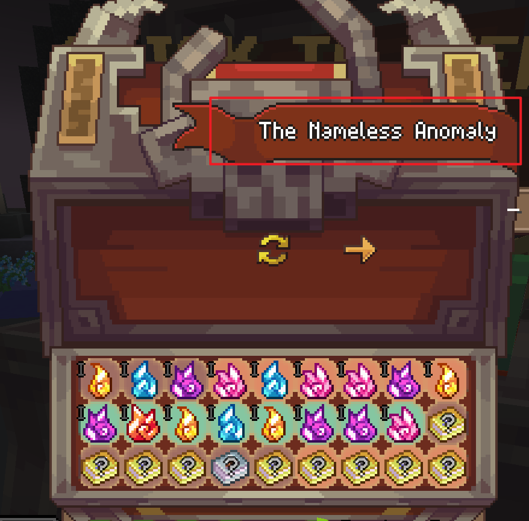

### Container Screen Title
In Wynncraft, custom container titles with texture pack are used in some ui for better visual. Below is an example:


This is handled by minecraft's bitmap custom font: 
```json
[{
    "type": "bitmap",
    "file": "font/interface/lootrun/title.png",
    "ascent": 48,
    "height": 48,
    "chars": [
        "",
        "",
        "",
        "",
        ""
    ]
},
{
    "type": "bitmap",
    "file": "font/interface/raid/title.png",
    "ascent": 48,
    "height": 48,
    "chars": [
        "",
        "",
        "",
        ""
    ]
}]
```

By dumping some of the screen titles, we can identify what screen are we on:
```
󏿲󏽯 Sky Lootrun Lootpool Preview
󏿪󏽯 TNA Lootpool Preview
```
They may look unrecognizable, but we can turn them into hex.
```
󏿲󏽯 f3 8f bf b2 ee 80 8a f3 8f bd af ef 80 89
󏿪󏽯 f3 8f bf aa ee 80 8d f3 8f bd af ef 80 8e
```
After further seperation, the structure is clear:
```
󏿲 f3 8f bf b2
 ee 80 8a
󏽯 f3 8f bd af
 ef 80 89
```
And by investigating into the texture pack, we can find all character from `f3 80 80 81` to `f3 9f bf bf`
are acturally control characters to define various indent, defined in the file `assets/minecraft/font/space.json`

```json
{"providers":[{"type":"space","advances":{"󀀁":-16384,"󏰀":-1024, ..., "󐐀":1024,"󟿿":16384}}]}
```


Leaving us two characters for identifying the screen:
```
 ee 80 8a

 ef 80 89
```
The first character, or actually the second character in the title of lootrun and raid reward screen, is for the background part:
```json
{
    "type": "bitmap",
    "file": "font/interface/lootrun/treasure.png",
    "ascent": 60,
    "height": 256,
    "chars": [
        ""
    ]
}
```
And the fourth character is for the text part:
```json
{
    "type": "bitmap",
    "file": "font/interface/lootrun/title.png",
    "ascent": 48,
    "height": 48,
    "chars": [
        "",
        "",
        "",
        "", // <- I'm here
        ""
    ]
}
```

